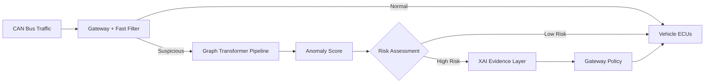
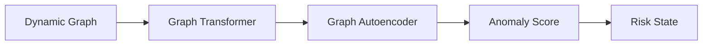
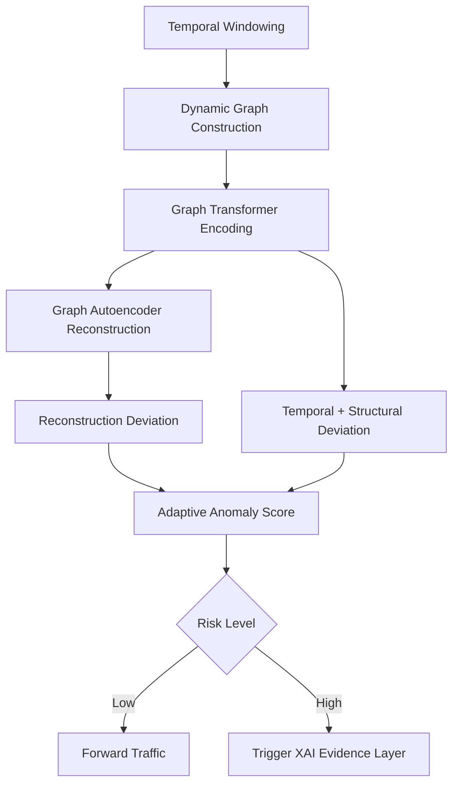
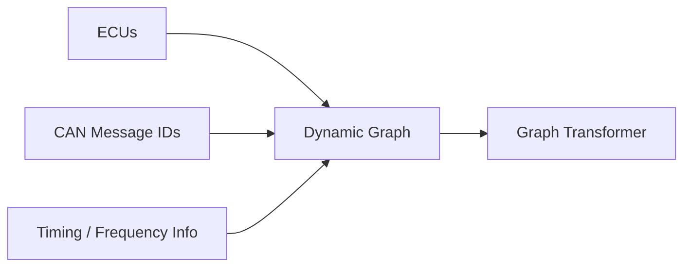
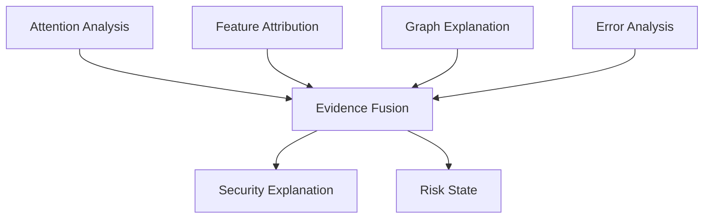
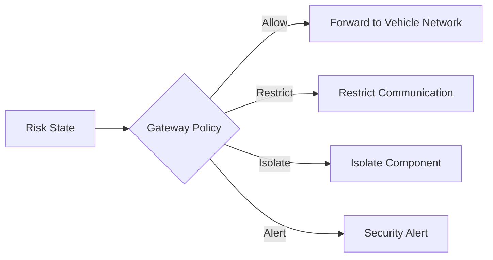

# An Explainable Graph-Based Transformer for Zero-Day Attack Detection in Autonomous Vehicles


> **Note on project status:** This repository currently contains the research design, system architecture, and planning documentation for the project described below. It does **not** yet contain a trained model or a complete working pipeline. Every section below is explicitly labeled as **Current**, **Planned**, or **Future Work** so that readers know exactly what exists today versus what is designed but not yet built.

---

## Table of Contents

1. [Introduction](#1-introduction)
2. [Problem Statement](#2-problem-statement)
3. [Research Motivation](#3-research-motivation)
4. [Research Gap](#4-research-gap)
5. [Objectives](#5-objectives)
6. [Proposed Solution](#6-proposed-solution)
7. [Overall Architecture](#7-overall-architecture)
8. [Detection Pipeline (Workflow)](#8-detection-pipeline-workflow)
9. [Technology Stack](#9-technology-stack)
10. [Directory Structure](#10-directory-structure)
11. [Installation](#11-installation)
12. [Usage](#12-usage)
13. [Graph Construction](#13-graph-construction)
14. [Anomaly Scoring](#14-anomaly-scoring)
15. [Explainability Layer](#15-explainability-layer)
16. [Gateway Policy & Containment](#16-gateway-policy--containment)
17. [Evaluation Metrics](#17-evaluation-metrics)
18. [Future Work](#18-future-work)

---

## 1. Introduction

This project proposes an **explainable, graph-based security architecture** for detecting previously unseen ("zero-day") attacks on the Controller Area Network (CAN) bus of an autonomous vehicle. CAN traffic between Electronic Control Units (ECUs) is represented as a **dynamic graph**, which is processed by a **Graph Transformer** to learn the structural and temporal behavior of normal vehicle communication. A **Graph Autoencoder** built on top of this representation flags deviations from learned normal behavior, producing an adaptive anomaly score rather than relying solely on predefined attack signatures. An **Explainable AI (XAI) layer** then converts the model's internal evidence into a human-readable security explanation, which is handed to a separate gateway policy layer responsible for enforcement.

The intended audience for this repository includes recruiters and hiring managers evaluating applied ML/security work, professors and thesis committees assessing research contribution and rigor, and automotive-security or ML researchers interested in graph-based intrusion detection.

## 2. Problem Statement

CAN was designed for efficient, reliable communication between ECUs, not for security. It provides no native authentication, encryption, or intrusion detection, which means a compromised or spoofed ECU can inject malicious frames that appear to come from a legitimate component. Signature-based Intrusion Detection Systems (IDS) can catch known attack patterns, but they share a fundamental limitation:

> A previously unseen attack may not match any known signature.

This project proposes a graph-based, **behavioral anomaly detection** system that learns what *normal* CAN network behavior looks like — structurally and temporally — so that deviations, including attacks with no prior signature, can be flagged and explained, rather than only classified against a fixed attack list.

## 3. Research Motivation

CAN networks are particularly challenging to secure because many ECUs share a single communication bus, and any node on that bus can, in principle, inject frames. As vehicles add more connected ECUs and external interfaces (telematics, infotainment, V2X), two problems become critical:

- **Unknown attack coverage** — signature-based IDS only detects attacks it has already seen. Novel injection, spoofing, or fuzzing strategies can bypass static rule sets entirely.
- **Decision opacity** — even when an anomaly-based model flags suspicious traffic, a raw anomaly score gives a security engineer (or an automated gateway) little to act on. Understanding *which ECUs, which frames, and which relationships* drove the alert is important for triage, trust, and any eventual safety certification.

A dynamic graph representation combined with attention-based modeling is a natural fit for both problems: graphs capture the relational structure between ECUs and messages without hand-crafted feature engineering, and both attention weights and reconstruction error offer inspectable signals that can be turned into explanations rather than a single opaque score.

## 4. Research Gap

| Existing Approach | Limitation |
|---|---|
| Signature-based IDS (rule/pattern matching) | Cannot detect attacks that do not match a known signature; requires continuous manual rule updates |
| Statistical / frequency-based anomaly detection (e.g., message timing or entropy thresholds) | Captures simple timing anomalies but ignores relational structure between ECUs; prone to false positives under legitimate but bursty traffic |
| Classical machine learning classifiers (e.g., SVM, Random Forest on handcrafted features) | Requires labeled attack data for training; generalizes poorly to attack types not present in the training set |
| Deep learning IDS without graph structure (e.g., CNN/LSTM on raw CAN sequences) | Can model temporal patterns but does not explicitly represent the relational structure between ECUs and message IDs |
| Graph Neural Network (GNN)-based IDS | Captures relational structure, but standard message-passing GNNs have limited long-range attention and typically offer weaker built-in interpretability than attention-based models |
| Most anomaly-based automotive IDS research | Rarely pairs graph-based relational reasoning **with** a dedicated, evidence-based explainability layer and a decoupled containment policy in the same system |

The gap this project targets is the **combination** of (a) dynamic graph modeling of CAN traffic reasoned over by a Graph Transformer, (b) unsupervised anomaly detection via a Graph Autoencoder so the system is not limited to known attack labels, and (c) a dedicated XAI evidence layer feeding a separate, explicit gateway policy — rather than any single one of these components in isolation.

## 5. Objectives

- Model CAN bus traffic as a dynamic graph of ECUs and message relationships.
- Use a Graph Transformer to learn the structural and temporal behavior of normal vehicle communication.
- Use a Graph Autoencoder to detect deviations from learned normal behavior without depending entirely on labeled attack signatures.
- Combine reconstruction, temporal, and graph-structural deviations into a single adaptive anomaly score.
- Build an XAI evidence layer that turns model internals (attention, reconstruction error, graph structure) into a human-readable security explanation.
- Keep detection/explanation (ML) and containment (gateway policy) as clearly separated responsibilities.
- Evaluate the approach against classical and deep-learning IDS baselines on both known and simulated zero-day attacks.

## 6. Proposed Solution

The proposed system sits behind a fast deterministic filter at the vehicle gateway: traffic that is clearly normal or clearly invalid is handled immediately, while suspicious or uncertain traffic is passed into the learned pipeline. That traffic is windowed in time, converted into a **dynamic graph** of ECUs and message relationships, and encoded by a **Graph Transformer** into a latent representation. A **Graph Autoencoder** attempts to reconstruct that representation; the reconstruction error, combined with temporal and graph-structural deviation signals, produces an **adaptive anomaly score**. Traffic assessed as high-risk is passed to an **XAI evidence layer**, which fuses attention analysis, feature attribution, graph explanation, and error analysis into a security explanation and a risk state. That risk state — not the raw model — drives the **gateway policy**, which decides whether to allow, restrict, isolate, or alert.

**Why this design?**

| Decision | Reason |
|---|---|
| Graph representation instead of raw/flattened CAN frames | Naturally captures relationships between ECUs and message IDs, and scales to a variable, evolving set of bus participants |
| Graph Transformer instead of a standard GNN | Self-attention lets any node attend to any other node directly (not just local neighbors after k hops), and attention weights are a natural interpretability signal |
| Graph Autoencoder for anomaly detection instead of a supervised classifier | Learns what *normal* traffic looks like from largely unlabeled data, so it is not limited to attacks seen during training — a requirement for zero-day detection |
| Combining reconstruction, temporal, and structural deviation into one score | A single deviation signal (e.g., reconstruction error alone) can miss attacks that are structurally anomalous but locally well-reconstructed, or vice versa |
| Separate XAI evidence layer | Decouples "why is this suspicious" from "what should the vehicle do about it," so the explanation stays interpretable even as the model or policy evolves independently |
| Fast deterministic filter ahead of the learned pipeline | Keeps latency low for the vast majority of normal traffic; the (comparatively) heavier graph pipeline is only invoked for traffic that needs deeper analysis |
| Gateway policy as a distinct enforcement layer | Keeps security *enforcement* (allow/restrict/isolate/alert) as an explicit, auditable policy decision rather than an implicit side-effect of the model |

## 7. Overall Architecture



The gateway's fast filter forwards clearly normal traffic directly to the vehicle ECUs and routes only suspicious or uncertain traffic into the graph-based pipeline. That pipeline produces an anomaly score which drives a risk assessment: low-risk traffic is forwarded, while high-risk traffic is routed through the XAI evidence layer to produce an explanation, which in turn informs the gateway policy's enforcement decision.

### Decision Flow (high level)



**Why this separation?** Splitting "graph representation," "relational reasoning," "reconstruction-based detection," and "risk scoring" into distinct stages keeps each component independently testable — the Graph Transformer's embeddings can be evaluated on their own, and the anomaly-scoring logic can be tuned or replaced without changing how the graph itself is built.

## 8. Detection Pipeline (Workflow)



CAN traffic that reaches the learned pipeline is first grouped into temporal windows, then assembled into a dynamic graph of ECUs and message relationships. The Graph Transformer encodes that graph, and the Graph Autoencoder attempts to reconstruct the encoding. The reconstruction deviation is combined with temporal and graph-structural deviation signals into a single adaptive anomaly score, which determines whether traffic is simply forwarded or escalated to the explainability layer.

**Status: Planned.** This describes the intended detection loop; no training run or live pipeline has been executed yet in this repository.

## 9. Technology Stack

| Layer | Technology | Status |
|---|---|---|
| Programming Language | Python 3.10+ | Planned |
| Deep Learning Framework | PyTorch | Planned |
| Graph Neural Network / Attention Layers | PyTorch Geometric or a custom Graph Transformer implementation | Planned |
| Autoencoder | Custom Graph Autoencoder (built on the Graph Transformer encoder) | Planned |
| CAN Data Source | Public CAN intrusion-detection datasets (e.g., Car-Hacking / CICIoV-style datasets) or simulated CAN traffic | Planned |
| Explainability | Attention visualization, feature attribution, and graph-explanation tooling (e.g., GNNExplainer-style methods) | Planned |
| Gateway / Policy Simulation | Custom rule-based policy engine for allow/restrict/isolate/alert decisions | Planned |
| Experiment Tracking | TBD (e.g., Weights & Biases or TensorBoard) | Future consideration |

> The stack above reflects the intended technologies based on the project design. No dependency has been locked in with a working implementation yet — see [Installation](#11-installation).

## 10. Directory Structure

The structure below reflects the **planned** module breakdown. It has not yet been implemented as actual code in this repository.

```
project-root/
├── data/                       # Planned: raw and preprocessed CAN traffic / public IDS datasets
├── preprocessing/               # Module 1: temporal windowing, frame parsing, feature extraction
├── graph_builder/                # Module 2: dynamic graph construction (nodes/edges) from windowed traffic
├── graph_transformer/            # Module 3: core research contribution — relational/temporal encoder
├── autoencoder/                   # Module 4: Graph Autoencoder, reconstruction + deviation scoring
├── anomaly_scoring/                # Module 5: fusion of reconstruction, temporal, structural deviation
├── explainability/                  # Module 6: attention analysis, feature attribution, graph explanation
├── gateway_policy/                   # Module 7: risk-to-action mapping (allow/restrict/isolate/alert)
├── evaluation/                        # Module 8: baseline comparisons and metric computation
├── configs/                            # Planned: experiment/config files
├── notebooks/                           # Planned: analysis and visualization notebooks
└── README.md
```

## 11. Installation

> **Status: Planned.** No installable package or `requirements.txt` currently exists in this repository. The steps below describe the intended setup once the pipeline is implemented.

```bash
# 1. Clone the repository
git clone https://github.com/<your-username>/<your-repo>.git
cd <your-repo>

# 2. Create a virtual environment
python -m venv venv
source venv/bin/activate  # on Windows: venv\Scripts\activate

# 3. Install dependencies (planned)
pip install -r requirements.txt

# 4. Obtain a CAN intrusion-detection dataset separately
# (see Technology Stack for candidate public datasets)
```

## 12. Usage

> **Status: Planned.** The commands below describe the intended usage once training and evaluation scripts exist; they are not runnable yet.

```bash
# Build graphs from raw/preprocessed CAN traffic (planned entry point)
python build_graphs.py --config configs/default.yaml

# Train the Graph Transformer + Graph Autoencoder (planned entry point)
python train.py --config configs/default.yaml

# Score traffic and generate XAI explanations for high-risk windows (planned entry point)
python evaluate.py --checkpoint checkpoints/model.pt
```

## 13. Graph Construction



Each temporal window of CAN traffic is converted into a graph where nodes represent ECUs and/or message identifiers, and edges represent observed communication relationships, weighted or annotated with timing and frequency information. This graph is passed into the Graph Transformer for encoding.

**Why this representation?** No single signal — which ECU sent a frame, what message ID was used, or how frequently/rapidly it was sent — is sufficient on its own to characterize normal behavior. Combining them into a single graph keeps the downstream Graph Transformer and Autoencoder sensor/feature-agnostic, and lets the model learn relationships (e.g., an ECU suddenly communicating with a message ID it has never used) that simple threshold-based rules would miss.

**Status: Planned.** The specific rule for what constitutes an edge (e.g., co-occurrence within a window, a fixed communication schedule, or observed timing correlation) has not yet been finalized or implemented.

## 14. Anomaly Scoring

**Status: Planned — not yet finalized.** The anomaly scoring function has not been implemented or precisely specified. Based on the project's proposed architecture, the adaptive anomaly score is expected to combine multiple deviation signals, such as:

- **Reconstruction deviation** — how well the Graph Autoencoder can reconstruct the current graph's latent representation compared to learned normal behavior.
- **Temporal deviation** — how much the timing/frequency of current traffic differs from expected patterns for the relevant ECUs.
- **Graph-structural deviation** — how much the current graph's structure (e.g., new edges, unusual connectivity) differs from previously observed normal graphs.

The exact weighting and fusion method for these terms is future design work and will be documented here once finalized, to avoid overstating what has been decided.

## 15. Explainability Layer



When the anomaly score indicates high risk, the XAI evidence layer is triggered. Four complementary sources of evidence — Graph Transformer attention weights, feature attribution, structural graph explanation, and reconstruction error analysis — are fused into a single output: a human-readable **security explanation** (what looked anomalous and why) and a machine-usable **risk state** that is handed to the gateway policy.

**Why fuse multiple evidence sources instead of one?** Attention weights alone can highlight *which* relationships the model focused on without saying *what* was wrong with them; reconstruction error alone can flag *that* something was anomalous without saying *which* ECU or relationship drove it. Combining attention, attribution, graph structure, and error analysis is intended to produce an explanation that is both accurate and actionable for a security engineer.

**Status: Planned.** No explanation-generation pipeline has been implemented or evaluated yet; this section describes the intended mechanism, not a demonstrated result.

## 16. Gateway Policy & Containment



The risk state produced by the XAI evidence layer feeds a gateway policy layer that decides on one of four actions: allow the traffic through, restrict the offending ECU's communication, isolate the component entirely, or raise a security alert (these are not mutually exclusive — e.g., isolate + alert). This layer is intentionally kept separate from the ML pipeline: the model supplies evidence, and the gateway policy owns the enforcement decision, which keeps the system auditable and lets the policy be updated independently of the model.

**Status: Planned.** The rule set mapping risk states to specific gateway actions has not yet been implemented.

## 17. Evaluation Metrics

The proposed Graph Transformer + Graph Autoencoder approach is intended to be compared against the following baselines:

| Baseline |
|---|
| Signature-based IDS (rule matching) |
| Statistical / frequency-based anomaly detection |
| Classical ML classifier (e.g., SVM, Random Forest) |
| CNN/LSTM-based IDS (no graph structure) |
| Graph Neural Network (GNN)-based IDS |
| Graph Transformer + Graph Autoencoder (proposed) |

Using the following metrics:

| Metric | What it measures |
|---|---|
| Detection accuracy / F1-score | Overall correctness in distinguishing normal vs. attack traffic |
| Zero-day detection rate | Fraction of attack types *not seen during training* that are still correctly flagged as anomalous |
| False positive rate | How often normal traffic is incorrectly flagged as suspicious |
| Detection latency | Time from anomalous traffic appearing on the bus to a risk assessment being produced |
| Explanation fidelity | How well the generated security explanation reflects the actual evidence driving the anomaly score |
| Inference overhead | Computational cost of the graph pipeline relative to the fast deterministic filter, for real-time feasibility |

**Status: Planned.** No baseline has been trained or evaluated yet; this table defines the intended evaluation protocol.

## 18. Future Work

Beyond the core planned implementation described above, the following directions are identified as future work, roughly in order of expected research value:

- **Multi-vehicle / multi-dataset evaluation** — testing across multiple CAN datasets and vehicle platforms rather than a single dataset, to assess robustness.
- **Adaptive/online learning** — updating the model's notion of "normal" behavior over time as legitimate traffic patterns evolve, without requiring full retraining.
- **Cross-attack-family generalization** — systematically evaluating zero-day detection across distinct attack families (e.g., DoS, fuzzing, spoofing, replay), since generalization across attack types remains an open challenge in graph-based IDS research.
- **Hardware-in-the-loop validation** — evaluating whether the pipeline meets real-time latency and resource constraints on representative in-vehicle gateway hardware.
- **Richer explainability outputs** — extending beyond attention/error heatmaps to more structured, standardized security-incident reports.

---

### Project Novelty Self-Assessment

For transparency, an internal novelty self-assessment was used to guide scope decisions during planning:

| Scope | Self-assessed novelty |
|---|---|
| Graph representation + supervised classifier only | 3 / 10 |
| Graph Transformer + Graph Autoencoder (unsupervised anomaly detection) | 7 / 10 |
| + Explainability layer, evaluated for zero-day generalization | 8.5 / 10 |

This assessment reflects internal planning judgment, not a peer-reviewed evaluation, and is included here for transparency about how the project's scope was decided.
