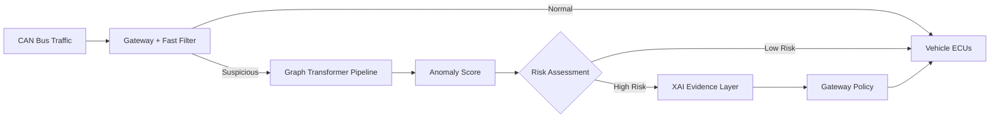
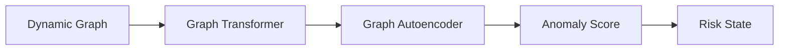
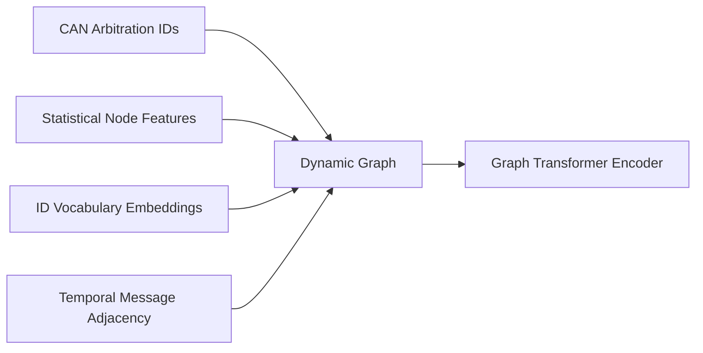
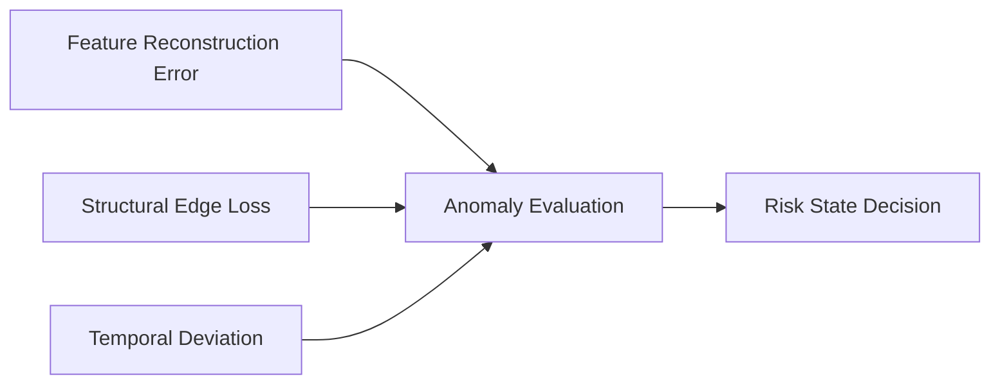
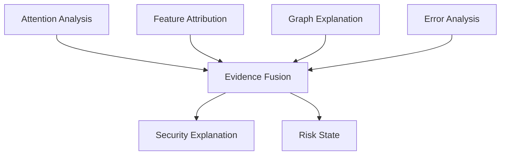
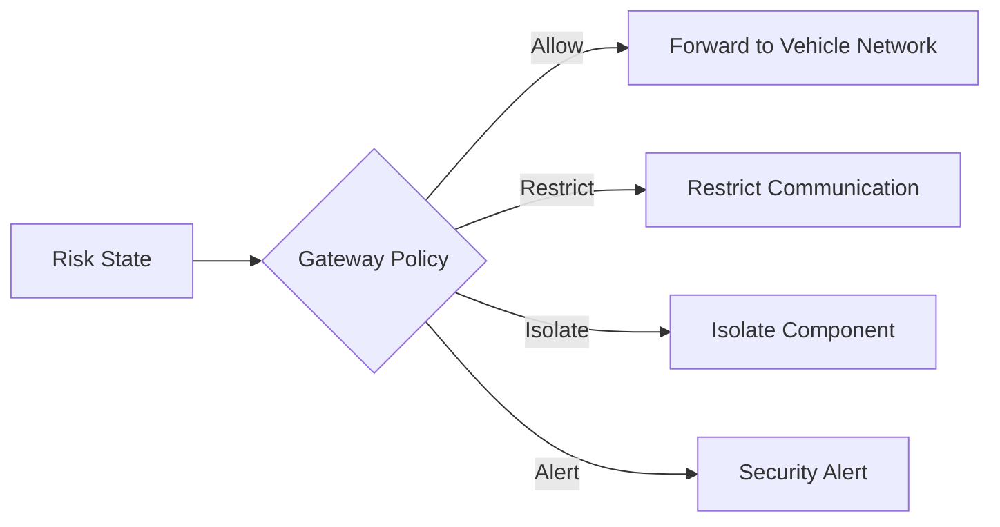

# An Explainable Graph-Based Transformer for Zero-Day Attack Detection in Autonomous Vehicles


> **Note on project status:** The core representation-learning and reconstruction-based anomaly detection pipeline is **implemented, trained, and functional** within [`graph-transformer/`](graph-transformer/). This includes ROAD dataset ingestion, temporal windowing, dynamic graph construction (9D node features + global arbitration ID embeddings + directed temporal adjacency edges), coupled `TransformerConv` encoder with attention extraction hooks, multi-component decoder, and capture-aware benign-only training. Multi-deviation anomaly score fusion, higher-level XAI evidence synthesis, and gateway containment policy remain in active development.

---

## Table of Contents

1. [Introduction](#1-introduction)
2. [Problem Statement](#2-problem-statement)
3. [Research Motivation](#3-research-motivation)
4. [Research Gap](#4-research-gap)
5. [Objectives](#5-objectives)
6. [Proposed Solution](#6-proposed-solution)
7. [Overall Architecture](#7-overall-architecture)
8. [Detection Pipeline (Workflow)](#8-detection-pipeline-workflow)
9. [Technology Stack](#9-technology-stack)
10. [Directory Structure](#10-directory-structure)
11. [Installation](#11-installation)
12. [Usage](#12-usage)
13. [Graph Construction](#13-graph-construction)
14. [Anomaly Scoring](#14-anomaly-scoring)
15. [Explainability Layer](#15-explainability-layer)
16. [Gateway Policy & Containment](#16-gateway-policy--containment)
17. [Evaluation Metrics](#17-evaluation-metrics)
18. [Future Work](#18-future-work)

---

## 1. Introduction

This project proposes an **explainable, graph-based security architecture** for detecting previously unseen ("zero-day") attacks on the Controller Area Network (CAN) bus of an autonomous vehicle. CAN traffic between Electronic Control Units (ECUs) is represented as a **dynamic graph**, which is processed by a **Graph Transformer** to learn the structural and temporal behavior of normal vehicle communication. A **Graph Autoencoder** built on top of this representation flags deviations from learned normal behavior, producing an adaptive anomaly score rather than relying solely on predefined attack signatures. An **Explainable AI (XAI) layer** then converts the model's internal evidence into a human-readable security explanation, which is handed to a separate gateway policy layer responsible for enforcement.

The intended audience for this repository includes recruiters and hiring managers evaluating applied ML/security work, professors and thesis committees assessing research contribution and rigor, and automotive-security or ML researchers interested in graph-based intrusion detection.

## 2. Problem Statement

CAN was designed for efficient, reliable communication between ECUs, not for security. It provides no native authentication, encryption, or intrusion detection, which means a compromised or spoofed ECU can inject malicious frames that appear to come from a legitimate component. Signature-based Intrusion Detection Systems (IDS) can catch known attack patterns, but they share a fundamental limitation:

> A previously unseen attack may not match any known signature.

This project proposes a graph-based, **behavioral anomaly detection** system that learns what *normal* CAN network behavior looks like — structurally and temporally — so that deviations, including attacks with no prior signature, can be flagged and explained, rather than only classified against a fixed attack list.

## 3. Research Motivation

CAN networks are particularly challenging to secure because many ECUs share a single communication bus, and any node on that bus can, in principle, inject frames. As vehicles add more connected ECUs and external interfaces (telematics, infotainment, V2X), two problems become critical:

- **Unknown attack coverage** — signature-based IDS only detects attacks it has already seen. Novel injection, spoofing, or fuzzing strategies can bypass static rule sets entirely.
- **Decision opacity** — even when an anomaly-based model flags suspicious traffic, a raw anomaly score gives a security engineer (or an automated gateway) little to act on. Understanding *which ECUs, which frames, and which relationships* drove the alert is important for triage, trust, and any eventual safety certification.

A dynamic graph representation combined with attention-based modeling is a natural fit for both problems: graphs capture the relational structure between ECUs and messages without hand-crafted feature engineering, and both attention weights and reconstruction error offer inspectable signals that can be turned into explanations rather than a single opaque score.

## 4. Research Gap

| Existing Approach | Limitation |
|---|---|
| Signature-based IDS (rule/pattern matching) | Cannot detect attacks that do not match a known signature; requires continuous manual rule updates |
| Statistical / frequency-based anomaly detection (e.g., message timing or entropy thresholds) | Captures simple timing anomalies but ignores relational structure between ECUs; prone to false positives under legitimate but bursty traffic |
| Classical machine learning classifiers (e.g., SVM, Random Forest on handcrafted features) | Requires labeled attack data for training; generalizes poorly to attack types not present in the training set |
| Deep learning IDS without graph structure (e.g., CNN/LSTM on raw CAN sequences) | Can model temporal patterns but does not explicitly represent the relational structure between ECUs and message IDs |
| Graph Neural Network (GNN)-based IDS | Captures relational structure, but standard message-passing GNNs have limited long-range attention and typically offer weaker built-in interpretability than attention-based models |
| Most anomaly-based automotive IDS research | Rarely pairs graph-based relational reasoning **with** a dedicated, evidence-based explainability layer and a decoupled containment policy in the same system |

The gap this project targets is the **combination** of (a) dynamic graph modeling of CAN traffic reasoned over by a Graph Transformer, (b) unsupervised anomaly detection via a Graph Autoencoder so the system is not limited to known attack labels, and (c) a dedicated XAI evidence layer feeding a separate, explicit gateway policy — rather than any single one of these components in isolation.

## 5. Objectives

- Model CAN bus traffic as a dynamic graph of ECUs and message relationships.
- Use a Graph Transformer to learn the structural and temporal behavior of normal vehicle communication.
- Use a Graph Autoencoder to detect deviations from learned normal behavior without depending entirely on labeled attack signatures.
- Combine reconstruction, temporal, and graph-structural deviations into a single adaptive anomaly score.
- Build an XAI evidence layer that turns model internals (attention, reconstruction error, graph structure) into a human-readable security explanation.
- Keep detection/explanation (ML) and containment (gateway policy) as clearly separated responsibilities.
- Evaluate the approach against classical and deep-learning IDS baselines on both known and simulated zero-day attacks.

## 6. Proposed Solution

The proposed system sits behind a fast deterministic filter at the vehicle gateway: traffic that is clearly normal or clearly invalid is handled immediately, while suspicious or uncertain traffic is passed into the learned pipeline. That traffic is windowed in time, converted into a **dynamic graph** of ECUs and message relationships, and encoded by a **Graph Transformer** into a latent representation. A **Graph Autoencoder** attempts to reconstruct that representation; the reconstruction error, combined with temporal and graph-structural deviation signals, produces an **adaptive anomaly score**. Traffic assessed as high-risk is passed to an **XAI evidence layer**, which fuses attention analysis, feature attribution, graph explanation, and error analysis into a security explanation and a risk state. That risk state — not the raw model — drives the **gateway policy**, which decides whether to allow, restrict, isolate, or alert.

**Why this design?**

| Decision | Reason |
|---|---|
| Graph representation instead of raw/flattened CAN frames | Naturally captures relationships between ECUs and message IDs, and scales to a variable, evolving set of bus participants |
| Graph Transformer instead of a standard GNN | Self-attention lets any node attend to any other node directly (not just local neighbors after k hops), and attention weights are a natural interpretability signal |
| Graph Autoencoder for anomaly detection instead of a supervised classifier | Learns what *normal* traffic looks like from largely unlabeled data, so it is not limited to attacks seen during training — a requirement for zero-day detection |
| Combining reconstruction, temporal, and structural deviation into one score | A single deviation signal (e.g., reconstruction error alone) can miss attacks that are structurally anomalous but locally well-reconstructed, or vice versa |
| Separate XAI evidence layer | Decouples "why is this suspicious" from "what should the vehicle do about it," so the explanation stays interpretable even as the model or policy evolves independently |
| Fast deterministic filter ahead of the learned pipeline | Keeps latency low for the vast majority of normal traffic; the (comparatively) heavier graph pipeline is only invoked for traffic that needs deeper analysis |
| Gateway policy as a distinct enforcement layer | Keeps security *enforcement* (allow/restrict/isolate/alert) as an explicit, auditable policy decision rather than an implicit side-effect of the model |

## 7. Overall Architecture



The gateway's fast filter forwards clearly normal traffic directly to the vehicle ECUs and routes only suspicious or uncertain traffic into the graph-based pipeline. That pipeline produces an anomaly score which drives a risk assessment: low-risk traffic is forwarded, while high-risk traffic is routed through the XAI evidence layer to produce an explanation, which in turn informs the gateway policy's enforcement decision.

### Decision Flow (high level)



**Why this separation?** Splitting "graph representation," "relational reasoning," "reconstruction-based detection," and "risk scoring" into distinct stages keeps each component independently testable — the Graph Transformer's embeddings can be evaluated on their own, and the anomaly-scoring logic can be tuned or replaced without changing how the graph itself is built.

## 8. Detection Pipeline (Workflow)


CAN traffic that reaches the learned pipeline is first grouped into temporal windows, then assembled into a dynamic graph of CAN arbitration IDs and message transition relationships. The Graph Transformer encodes that graph, and the Graph Autoencoder attempts to reconstruct the node statistical features and structural edges. The reconstruction error (currently evaluated per capture on held-out attacks) is combined with temporal and graph-structural deviation signals to distinguish normal driving behavior from zero-day masquerade and injection attacks.

**Status: Core Representation & Reconstruction Detection Implemented.** The windowing, graph builder, coupled model, and benign-only training with per-capture evaluation are functional in `graph-transformer/`. Extended anomaly score fusion and XAI evidence generation are in active development.

## 9. Technology Stack

| Layer | Technology | Status |
|---|---|---|
| Programming Language | Python 3.10+ | Implemented |
| Deep Learning Framework | PyTorch (>= 2.1) | Implemented |
| Graph Neural Network / Attention Layers | PyTorch Geometric (`TransformerConv` multi-head edge-conditioned attention) | Implemented |
| Autoencoder Architecture | Coupled `GraphTransformerAutoencoder` (MLP node feature decoder + inner-product edge decoder) | Implemented |
| CAN Data Source | ROAD (Real Autonomous Driving) Dataset (ORNL) — signal-translated ambient + attack captures | Implemented |
| Preprocessing & Windowing | Custom sliding-window parser (`preprocess.py`) with configurable strides | Implemented |
| Dynamic Graph Generation | Custom PyG graph builder (`graph_builder.py`) with 9D node stats & ID vocabulary embedding | Implemented |
| Explainability Layer | Attention weight hooks (`get_attention_weights`), feature attribution, graph explanation | In Progress / Planned |
| Gateway / Policy Simulation | Custom rule-based policy engine for allow/restrict/isolate/alert decisions | Planned |
| Experiment Tracking | PyTorch checkpoints + per-capture metric logs (TensorBoard/W&B integration planned) | In Progress |

## 10. Directory Structure

```
capstone/
├── attack-detection/          # Module: Zero-day detection mechanisms, anomaly fusion, risk assessment
│   └── README.md              # Conceptual architecture and scoring design
├── explainability/            # Module: XAI evidence layer (attention analysis, attribution, reasoning)
│   └── README.md              # XAI pipeline, fusion design, and security reporting
├── graph-transformer/         # Module: Core representation learning & GAE detection pipeline
│   ├── CHANGELOG.md           # Milestone & engineering change history
│   ├── README.md              # Detailed architecture, schema, & usage documentation
│   ├── preprocess.py          # Data ingestion & temporal windowing for ROAD dataset
│   ├── graph_builder.py       # Dynamic graph construction (9D node features, global ID vocab, directed edges)
│   ├── model.py               # Coupled GraphTransformerAutoencoder (TransformerConv + MLP/edge decoders)
│   ├── train.py               # Benign-only training, capture-aware CV, train-only normalization, evaluation
│   ├── road/                  # Local ROAD dataset directory (signal-translated CSVs)
│   └── outputs/               # Serialized window records, graph dataset, vocab, and best_model.pt
├── requirements.txt           # Core Python dependencies
├── LICENSE                    # MIT License
└── README.md                  # Project overview and research documentation
```

## 11. Installation

**Status: Functional.** The data preprocessing, graph construction, model definition, and training pipeline in `graph-transformer/` are fully implemented and runnable. See the [Graph Transformer Changelog](graph-transformer/CHANGELOG.md) for recent engineering updates.

```bash
# 1. Clone the repository
git clone https://github.com/Etrlnx/pjt_1.git
cd pjt_1

# 2. Create a virtual environment
python -m venv venv
source venv/bin/activate  # on Windows: venv\Scripts\activate

# 3. Install PyTorch and PyTorch Geometric FIRST, following official platform/CUDA selectors:
#      - PyTorch:           https://pytorch.org/get-started/locally/
#      - PyTorch Geometric: https://pytorch-geometric.readthedocs.io/en/latest/install/installation.html

# 4. Install remaining dependencies
pip install -r requirements.txt

# 5. Download and extract the ROAD dataset under graph-transformer/road/
#    The directory structure should be:
#    graph-transformer/road/road/signal_extractions/ambient/*.csv
#    graph-transformer/road/road/signal_extractions/attacks/*.csv
```

## 12. Usage

The core pipeline can be executed in sequence from the repository root:

```bash
# Step 1: Preprocess raw ROAD dataset into temporal window records
python graph-transformer/preprocess.py
# -> Emits outputs/road_windowed.pkl (WindowRecord objects with raw message DataFrames)

# Step 2: Build dynamic PyTorch Geometric graphs and global ID vocabulary
python graph-transformer/graph_builder.py
# -> Emits outputs/graphs.pt (PyG Data objects) and outputs/vocab.pkl

# Step 3: Train Graph Transformer + Autoencoder on benign captures & evaluate on held-out attacks
python graph-transformer/train.py
# -> Trains on benign-only graphs, standardizes features via train-set statistics,
#    saves outputs/best_model.pt, and prints a per-capture reconstruction error breakdown.
```

## 13. Graph Construction



Each temporal window ($W = 2.0\text{s}$) of CAN traffic is converted into a PyTorch Geometric `Data` graph:

- **Nodes**: Each distinct CAN arbitration ID present in the window.
- **Node Feature Vector (9 Dimensions)**:
  1. `msg_count`: Total messages from this ID in the window.
  2. `mean_iat`: Mean inter-arrival time between consecutive messages of this ID.
  3. `std_iat`: Standard deviation of inter-arrival time.
  4. `signal_mean`: Mean across all non-NaN decoded signal values for this ID.
  5. `signal_std`: Standard deviation of decoded signals.
  6. `signal_min`: Minimum decoded signal value.
  7. `signal_max`: Maximum decoded signal value.
  8. `activity_share`: Fraction of window traffic from this ID (`msg_count / total_window_messages`).
  9. `signal_range`: Range of decoded signals (`signal_max - signal_min`).
- **Node Identity Embedding**: An integer index into a global ID vocabulary (106 unique IDs including `<UNK>` at index 0) projected into a 20-dimensional learned embedding space.
- **Edges**: Directed edges representing temporal message adjacency (consecutive messages with different arbitration IDs). Edge attributes (`edge_attr`) store the count of such transitions within the window.

**Status: Implemented.** See [`graph-transformer/graph_builder.py`](graph-transformer/graph_builder.py) for the complete graph generation implementation.

## 14. Anomaly Scoring



Anomaly detection is formulated as an **unsupervised one-class reconstruction task**:

- **Model Training**: The coupled `GraphTransformerAutoencoder` is trained exclusively on benign ambient captures ($y = 0$).
- **Reconstruction Loss**:
  $$\mathcal{L}_{\text{total}} = \mathcal{L}_{\text{node}} + \mathbb{I}_{\text{edge\_recon}} \cdot \mathcal{L}_{\text{edge}}$$
  where $\mathcal{L}_{\text{node}}$ is a weighted MSE across node feature residuals giving higher penalty to anomaly-sensitive dimensions (`signal_std`, `signal_max`, `activity_share`, `signal_range`), and $\mathcal{L}_{\text{edge}}$ is binary cross-entropy on inner-product reconstructed edge logits.
- **Evaluation Strategy**: All attack captures (including masquerade attacks) are held out for testing. Evaluation runs with single-graph batches (`batch_size=1`) to retain capture metadata and calculate per-capture reconstruction error distributions alongside aggregate benign-vs-attack separation.

**Status: Core Reconstruction Implemented; Multi-term Fusion In Progress.** See [`graph-transformer/train.py`](graph-transformer/train.py) and [`attack-detection/README.md`](attack-detection/README.md).

## 15. Explainability Layer



When the anomaly score indicates high risk, the XAI evidence layer is triggered. Four complementary sources of evidence — Graph Transformer attention weights (hooked via `model.get_attention_weights()`), feature attribution, structural graph explanation, and reconstruction error analysis — are fused into a single output: a human-readable **security explanation** (what looked anomalous and why) and a machine-usable **risk state** that is handed to the gateway policy.

**Why fuse multiple evidence sources instead of one?** Attention weights alone can highlight *which* relationships the model focused on without saying *what* was wrong with them; reconstruction error alone can flag *that* something was anomalous without saying *which* ECU or relationship drove it. Combining attention, attribution, graph structure, and error analysis produces an explanation that is both accurate and actionable for a security engineer.

**Status: Planned / In Progress.** See [`explainability/README.md`](explainability/README.md) for full design specifications.

## 16. Gateway Policy & Containment



The risk state produced by the XAI evidence layer feeds a gateway policy layer that decides on one of four actions: allow the traffic through, restrict the offending ECU's communication, isolate the component entirely, or raise a security alert (these are not mutually exclusive — e.g., isolate + alert). This layer is intentionally kept separate from the ML pipeline: the model supplies evidence, and the gateway policy owns the enforcement decision, which keeps the system auditable and lets the policy be updated independently of the model.

**Status: Planned.** The rule set mapping risk states to specific gateway actions is documented in the design specifications.

## 17. Evaluation Metrics

The proposed Graph Transformer + Graph Autoencoder approach is evaluated against standard and zero-day intrusion detection benchmarks:

| Baseline |
|---|
| Signature-based IDS (rule matching) |
| Statistical / frequency-based anomaly detection |
| Classical ML classifier (e.g., SVM, Random Forest) |
| CNN/LSTM-based IDS (no graph structure) |
| Standard GNN-based IDS (e.g., GCN/GAT without dynamic temporal windowing) |
| **Graph Transformer + Graph Autoencoder (Proposed)** |

Using the following metrics:

| Metric | What it measures |
|---|---|
| Detection accuracy / F1-score | Overall correctness in distinguishing normal vs. attack traffic |
| Zero-day detection rate | Fraction of attack types *not seen during training* that are still correctly flagged as anomalous |
| False positive rate | How often normal traffic is incorrectly flagged as suspicious |
| Detection latency | Time from anomalous traffic appearing on the bus to a risk assessment being produced |
| Explanation fidelity | How well the generated security explanation reflects the actual evidence driving the anomaly score |
| Inference overhead | Computational cost of the graph pipeline relative to real-time execution constraints |

## 18. Future Work

Beyond the core implemented representation and detection pipeline:

- **Multi-vehicle / multi-dataset evaluation** — testing across multiple CAN datasets (e.g., Car-Hacking, syncCAN) and vehicle platforms.
- **Adaptive/online learning** — updating the model's notion of "normal" behavior over time as legitimate traffic patterns evolve.
- **Cross-attack-family generalization** — systematically evaluating zero-day detection across distinct attack families (masquerade, fuzzing, spoofing, replay).
- **Hardware-in-the-loop validation** — evaluating whether the pipeline meets real-time latency and resource constraints on representative in-vehicle gateway hardware.
- **Structured XAI incident reports** — automating machine-readable JSON security incident reports with localized graph heatmaps.

---

### Project Novelty Self-Assessment

For transparency, an internal novelty self-assessment was used to guide scope decisions during planning:

| Scope | Self-assessed novelty |
|---|---|
| Graph representation + supervised classifier only | 3 / 10 |
| Graph Transformer + Graph Autoencoder (unsupervised anomaly detection) | 7 / 10 |
| + Explainability layer, evaluated for zero-day generalization | 8.5 / 10 |

This assessment reflects internal planning judgment, not a peer-reviewed evaluation, and is included here for transparency about how the project's scope was decided.
