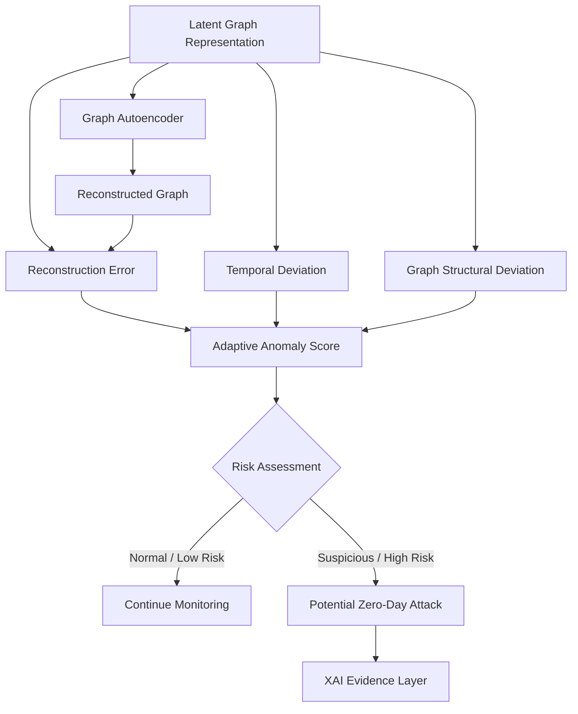

# Zero-Day Detection Mechanism

## Overview

The Zero-Day Detection Mechanism is responsible for identifying CAN communication that deviates from learned normal behavior.

The system does not rely exclusively on predefined attack signatures.

Instead, it learns the expected behavior of the CAN communication graph and evaluates how well new observations conform to that learned behavior.

The mechanism combines:

- Graph Transformer representations
- Graph Autoencoder reconstruction
- Temporal deviation
- Graph-structural deviation
- Adaptive anomaly scoring
- Risk assessment

The complete detection flow is:

```text
Latent Graph Representation
        ↓
Graph Autoencoder
        ↓
Reconstructed Graph
        ↓
 ┌───────────────┬────────────────┐
 ↓               ↓                ↓
Reconstruction   Temporal         Graph
Error            Deviation        Deviation
 └───────────────┴────────────────┘
                 ↓
       Adaptive Anomaly Score
                 ↓
          Risk Assessment
```

---

# 1. Purpose

The purpose of this module is to answer:

> Does the current CAN communication behavior significantly differ from the behavior learned as normal?

This is fundamentally different from asking:

> Which known attack class does this traffic belong to?

This distinction is important for evaluating previously unseen or zero-day attack behavior.

---

# 2. Architecture



---

# 3. Graph Autoencoder

The Graph Autoencoder attempts to reconstruct the observed graph representation.

Conceptually:

```text
Input Graph
     ↓
Encoder
     ↓
Latent Representation
     ↓
Decoder
     ↓
Reconstructed Graph
```

The reconstruction is compared against the original representation.

If the observed behavior resembles the behavior learned during training, reconstruction should generally be easier.

If the behavior is substantially different, reconstruction error may increase.

---

# 4. Reconstruction Error

Reconstruction error measures the difference between the observed graph and the reconstructed graph.

Conceptually:

```text
Observed Graph
      │
      ├───────────────┐
      │               │
      ▼               ▼
Original        Reconstructed
Representation    Representation
      │               │
      └───────┬───────┘
              ↓
     Reconstruction Error
```

A generalized representation can be written as:

```text
R_error = Distance(G, G_reconstructed)
```

The exact distance function should be selected according to the graph representation and model architecture.

Potential forms include:

- Feature reconstruction loss
- Node-level reconstruction error
- Edge-level reconstruction error
- Latent-space distance
- Combined graph reconstruction loss

---

# 5. Temporal Deviation

Reconstruction alone may not capture every abnormal behavior.

The system therefore considers temporal deviation.

Examples include:

- Sudden increases in message frequency
- Abnormal inter-arrival times
- Unexpected communication bursts
- Temporal inconsistencies
- Abrupt changes in communication patterns

Conceptually:

```text
Previous Windows
       ↓
Expected Temporal Behavior
       ↓
Current Window
       ↓
Temporal Deviation
```

This allows the system to consider how communication changes over time.

---

# 6. Graph Structural Deviation

The system also evaluates changes in communication structure.

Examples include:

- Unexpected communication relationships
- New communication paths
- Missing expected relationships
- Abnormal connectivity
- Significant structural changes

Conceptually:

```text
Expected Graph Structure
          ↓
        Compare
          ↑
Observed Graph Structure
          ↓
Graph Structural Deviation
```

This is particularly important because an attack may alter communication relationships without producing an obviously abnormal individual frame.

---

# 7. Adaptive Anomaly Score

The individual signals are combined into an anomaly score.

A generalized formulation is:

```text
S_anomaly =
    α R_error
  + β T_error
  + γ G_error
```

where:

- `R_error` = reconstruction error
- `T_error` = temporal deviation
- `G_error` = graph-structural deviation
- `α`, `β`, `γ` = weighting parameters

The values should be determined experimentally.

The final implementation may additionally use:

- normalization
- adaptive thresholds
- statistical calibration
- confidence estimation

The project should avoid arbitrarily selecting thresholds without experimental justification.

---

# 8. Risk Assessment

The anomaly score is converted into a security state.

A simple conceptual model is:

```text
Anomaly Score
      ↓
 ┌────┴────┐
 ↓         ↓
Low       High
Risk      Risk
 ↓         ↓
Monitor   Investigate
```

The system should distinguish between:

- Normal
- Suspicious
- High-risk anomalous

An anomaly should not automatically be treated as a confirmed attack.

This is important because legitimate vehicle behavior can occasionally deviate from previously observed patterns.

---

# 9. Zero-Day Detection

The zero-day experiment is based on evaluating the system against attack behavior that was not directly available during training.

A valid experimental setup could conceptually separate:

```text
Training
 ├── Normal Traffic
 └── Selected Known Attacks

Testing
 ├── Normal Traffic
 ├── Known Attacks
 └── Unseen Attack Behavior
```

The purpose is to determine whether the model can recognize abnormal behavior without having previously learned the exact attack pattern.

The project should explicitly define what "zero-day" means in the experimental protocol.

---

# 10. Zero-Day vs Known-Attack Classification

The system should not be presented as simply another multi-class attack classifier.

A traditional classifier might perform:

```text
CAN Frame
    ↓
Classifier
    ↓
DoS / Replay / Spoofing / Normal
```

The proposed mechanism instead emphasizes:

```text
CAN Behavior
      ↓
Learn Normal Behavior
      ↓
Measure Deviation
      ↓
Anomaly Score
      ↓
Potentially Unseen Attack
```

Known attack labels can still be used for evaluation.

They should not be the only basis for detection.

---

# 11. False Positives

A major challenge is false-positive behavior.

Unusual but legitimate vehicle behavior may produce:

```text
High Anomaly Score
```

without representing an attack.

Therefore, evaluation must measure:

- False Positive Rate
- Precision
- Recall
- F1-score
- Detection latency

A strong zero-day detector should not simply maximize anomaly sensitivity.

It should balance sensitivity with acceptable false-positive behavior.

---

# 12. Detection Output

The module produces:

```text
Anomaly Score
Risk State
Detection Evidence
```

For example:

```text
Risk State:
HIGH

Anomaly Score:
0.87

Contributing Evidence:
- High reconstruction error
- Abnormal message frequency
- Unexpected graph relationship
```

The exact numerical values and explanation format will depend on the final implementation.

---

# 13. Relationship With XAI

The zero-day detection mechanism identifies suspicious behavior.

The XAI layer then investigates why the behavior was considered anomalous.

```text
Zero-Day Detector
       ↓
Anomaly Score
       ↓
Risk State
       ↓
XAI
       ↓
Evidence
       ↓
Security Explanation
```

This creates a clear separation between:

**Detection**

and

**Explanation**

---

# 14. Relationship With Gateway

The ML detector does not directly enforce network isolation.

Instead:

```text
Anomaly Detection
       ↓
Risk State
       ↓
Gateway Policy
       ↓
Security Action
```

Possible policy outcomes include:

- Allow
- Restrict
- Isolate
- Alert

This prevents the anomaly detector from becoming tightly coupled to the enforcement mechanism.

---

# 15. Experimental Evaluation

The detection mechanism should be evaluated using:

### Classification Metrics

- Precision
- Recall
- F1-score
- Accuracy

### IDS Metrics

- False Positive Rate
- False Negative Rate
- Detection Rate
- Detection Latency

### Zero-Day Metrics

- Detection rate on unseen attacks
- Generalization to unseen attack behavior
- Performance degradation between known and unseen attacks

### Computational Metrics

- Inference latency
- Memory consumption
- Processing throughput

---

# 16. Ablation Study

The anomaly score can be evaluated by removing individual components.

```text
Full Detector
     │
     ├── Reconstruction Only
     ├── Reconstruction + Temporal
     ├── Reconstruction + Graph
     ├── Temporal + Graph
     └── Full Combined Score
```

This determines whether combining multiple anomaly signals actually improves detection.

---

# 17. Core Design Principle

The core principle is:

> A zero-day attack does not need to look like a previously known attack if it can be shown to violate the learned behavioral structure of the vehicle's CAN network.

The system therefore focuses on **behavioral deviation** rather than relying exclusively on attack signatures.