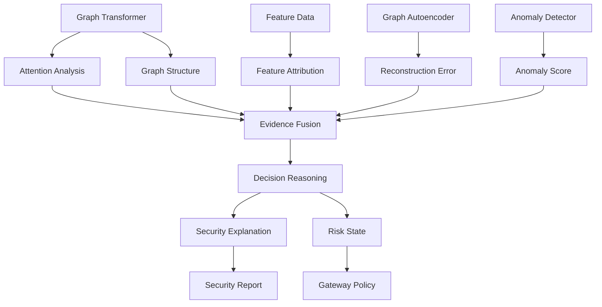

# Explainability Layer

## Overview

The Explainability Layer converts the internal evidence generated by the Graph Transformer and zero-day detection mechanism into a human-interpretable security explanation.

A detection system that produces only:

```text
Attack detected.
```

provides limited information to a security engineer.

The proposed system instead attempts to answer:

> Why was this CAN communication considered anomalous?

The XAI layer therefore combines multiple sources of model evidence, including:

- Graph attention
- Feature attribution
- Graph structure
- Reconstruction error
- Anomaly score
- Temporal deviation

These signals are passed through an evidence-fusion stage to produce a security-oriented explanation.

---

# 1. Purpose

The XAI layer has three primary objectives:

1. Identify the information that contributed to an anomaly decision.
2. Present that information in an interpretable form.
3. Provide evidence that can assist downstream security decisions.

It is important to distinguish **model evidence** from **causal certainty**.

An explanation should describe why the model made its decision without automatically claiming that the identified feature or graph relationship was the real-world cause of the attack.

---

# 2. Architecture



---

# 3. Explainability Pipeline

The complete pipeline is:

```text
Model Output
     ↓
Evidence Extraction
     ↓
Evidence Fusion
     ↓
Decision Reasoning
     ↓
Human-Interpretable Explanation
```

The objective is to transform internal model information into meaningful security evidence.

---

# 4. Graph Attention Analysis

The Graph Transformer uses attention mechanisms to determine the relative importance of graph elements during representation learning.

Attention can be analyzed to identify:

- Important nodes
- Important edges
- Important communication relationships
- Highly attended graph regions

Conceptually:

```text
Graph
  ↓
Transformer Attention
  ↓
Attention Weights
  ↓
Important Graph Elements
```

These results can be visualized to help understand which portions of the communication graph influenced the model.

---

# 5. Important Limitation of Attention

Attention should not automatically be interpreted as a causal explanation.

A high attention value means that the model assigned importance to a particular element within its computation.

It does not necessarily prove:

```text
"This component caused the attack."
```

Therefore, attention is treated as one source of evidence rather than the sole explanation.

---

# 6. Feature Attribution

Feature attribution attempts to identify which input features contributed most strongly to the model's output.

Potential techniques include:

- SHAP
- Gradient-based attribution
- Other model-compatible attribution methods

For example, an explanation might identify:

```text
High contribution:
- Message frequency
- Inter-arrival time

Moderate contribution:
- Payload statistics

Low contribution:
- Other features
```

The exact features depend on the final feature-engineering pipeline.

---

# 7. Graph Explanations

The XAI layer can also investigate the graph structure itself.

Potential questions include:

- Which nodes contributed to the anomaly?
- Which edges were important?
- Which communication relationships changed?
- Which graph region produced high reconstruction error?

Graph explanation techniques such as GNNExplainer-style methods may be investigated where technically compatible with the final architecture.

The project should select explanation methods based on actual model compatibility rather than including techniques purely for the sake of having multiple XAI algorithms.

---

# 8. Reconstruction Error Explanation

The zero-day detector produces reconstruction error.

This information can be localized where possible.

Conceptually:

```text
Observed Graph
      ↓
Graph Autoencoder
      ↓
Reconstructed Graph
      ↓
Difference
      ↓
High-Error Nodes / Edges / Features
```

This provides another form of evidence.

For example:

```text
High reconstruction error
        ↓
Affected communication relationship
        ↓
Possible abnormal behavior
```

This can be especially useful when the system encounters previously unseen behavior.

---

# 9. Temporal Evidence

Temporal deviation can also contribute to the explanation.

Examples include:

- Sudden message-frequency increase
- Abnormal inter-arrival time
- Unexpected communication burst
- Abrupt change from historical behavior

Conceptually:

```text
Historical Behavior
        ↓
Expected Pattern
        ↓
Current Behavior
        ↓
Temporal Deviation
```

This evidence can be combined with graph and feature-level evidence.

---

# 10. Anomaly Score

The overall anomaly score provides the quantitative summary of abnormality.

The XAI layer receives:

```text
Anomaly Score
```

but does not independently generate the score.

Instead, it uses the score alongside the contributing evidence.

For example:

```text
Anomaly Score: HIGH

Supporting Evidence:
- High reconstruction error
- Abnormal message frequency
- Unexpected communication edge
- High attention on affected graph region
```

---

# 11. Evidence Fusion

The central component of the XAI layer is evidence fusion.

The system combines:

```text
Graph Attention
       +
Feature Attribution
       +
Graph Structure
       +
Reconstruction Error
       +
Temporal Deviation
       +
Anomaly Score
       ↓
Evidence Fusion
```

The purpose is to prevent the explanation from depending entirely on a single XAI technique.

---

# 12. Decision Reasoning

Evidence fusion produces a structured interpretation.

Conceptually:

```text
Evidence
   ↓
Decision Reasoning
   ↓
Risk State
   +
Explanation
```

The reasoning layer can organize evidence into categories such as:

### Behavioral Evidence

```text
Abnormal message frequency
Abnormal timing
```

### Structural Evidence

```text
Unexpected communication relationship
Changed graph structure
```

### Model Evidence

```text
High reconstruction error
High attention
High feature attribution
```

### Overall Assessment

```text
High anomaly score
```

---

# 13. Example Security Explanation

A final explanation could conceptually resemble:

```text
Security Assessment: HIGH RISK

The observed CAN communication deviates significantly
from learned normal behavior.

Primary evidence:
- Increased communication frequency
- Elevated reconstruction error
- Unexpected graph relationship
- High model attention on the affected communication path

The behavior should be investigated as potentially anomalous.
```

The exact wording should ultimately be generated from actual model evidence rather than hard-coded claims.

---

# 14. Explanation Output

The XAI layer can produce multiple forms of output.

### Numerical

```text
Anomaly Score
Feature Contributions
Reconstruction Error
```

### Graphical

```text
Attention Graph
Highlighted Nodes
Highlighted Edges
Error Heatmaps
```

### Textual

```text
Security Explanation
```

### Structured

```text
{
    risk_state,
    anomaly_score,
    contributing_features,
    affected_nodes,
    affected_edges,
    temporal_evidence,
    reconstruction_evidence
}
```

The exact output format will depend on the final implementation.

---

# 15. Relationship With Zero-Day Detection

The XAI layer does not replace the anomaly detector.

The relationship is:

```text
Graph Transformer
       ↓
Latent Representation
       ↓
Zero-Day Detector
       ↓
Anomaly Score
       ↓
XAI
       ↓
Explanation
```

The detector determines:

> Is this behavior anomalous?

The XAI layer determines:

> What evidence contributed to that assessment?

---

# 16. Relationship With Gateway Policy

The XAI layer can provide supporting information to the security-policy layer.

The complete relationship is:

```text
CAN Traffic
    ↓
Detection
    ↓
Risk State
    ↓
XAI Evidence
    ↓
Gateway Policy
    ↓
Security Action
```

The XAI layer should not directly enforce isolation.

Instead, the gateway policy remains responsible for actions such as:

- Allow
- Restrict
- Isolate
- Alert

This separation keeps explanation, detection, and enforcement conceptually independent.

---

# 17. Explainability Evaluation

Explainability should not be evaluated merely by producing attractive visualizations.

Possible evaluation dimensions include:

### Fidelity

Does the explanation accurately represent the information used by the model?

### Stability

Does a small change in input produce a reasonable and consistent explanation?

### Relevance

Does the explanation identify information actually associated with the anomaly?

### Interpretability

Can a human security analyst understand the explanation?

### Consistency

Do different explanation mechanisms provide reasonably compatible evidence?

---

# 18. Candidate XAI Techniques

The project can investigate:

| Technique | Primary Purpose |
|---|---|
| Graph Attention Visualization | Identify highly attended graph regions |
| SHAP | Feature-level attribution |
| GNNExplainer-style methods | Identify influential graph structures |
| Reconstruction Error | Identify poorly reconstructed behavior |
| Temporal Analysis | Explain abnormal time-dependent behavior |

The final implementation should not require every technique.

Methods should be selected according to compatibility with the final Graph Transformer and anomaly-detection architecture.

---

# 19. XAI Ablation

The explanation system can also be evaluated by removing individual evidence sources.

```text
Full XAI
   │
   ├── Without Attention
   ├── Without Feature Attribution
   ├── Without Graph Explanation
   ├── Without Reconstruction Evidence
   └── Without Temporal Evidence
```

This can determine which forms of evidence provide the most useful explanations.

---

# 20. Security Interpretation

The XAI system should avoid making unsupported claims.

For example:

### Weak explanation

```text
ECU X is attacking the vehicle.
```

This implies certainty that the model cannot necessarily establish.

### Better explanation

```text
Communication involving ECU X contributed strongly
to the observed anomaly.

The communication pattern exhibited:
- increased frequency
- elevated reconstruction error
- unexpected graph connectivity
```

This distinction is important for a security system.

The model reports **evidence**, while the security system determines the appropriate response.

---

# 21. Core Design Principle

The central principle of the XAI layer is:

> Do not merely report that an anomaly was detected; expose the evidence that led the model to consider the behavior anomalous.

This transforms the system from a black-box anomaly detector into an explainable security-analysis pipeline.

---

# 22. Final XAI Flow

```text
Graph Transformer
       │
       ├── Attention
       │
       └── Graph Representation
                │
                ▼
       ┌──────────────────┐
       │ Zero-Day Detector │
       └──────────────────┘
                │
                ├── Reconstruction Error
                ├── Temporal Deviation
                ├── Graph Deviation
                └── Anomaly Score
                         │
                         ▼
                  Evidence Fusion
                         │
                         ▼
                  Decision Reasoning
                         │
                  ┌──────┴──────┐
                  ▼             ▼
             Explanation     Risk State
                  │             │
                  ▼             ▼
             Security       Gateway Policy
              Report
```

The XAI layer therefore acts as the interpretability bridge between the machine-learning detection system and the human/security-policy layer.