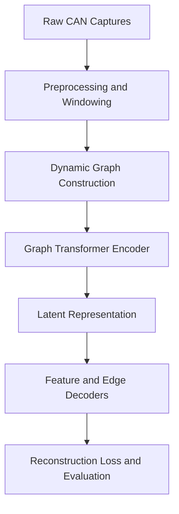
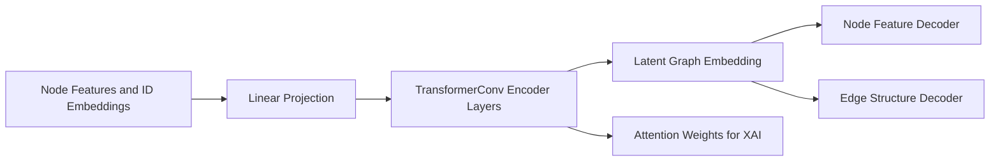

# Graph Transformer & Autoencoder Pipeline

## Overview

The `graph-transformer` module forms the core representation-learning and behavioral anomaly detection engine of the autonomous vehicle CAN security architecture.

Traditional CAN intrusion detection systems often treat messages as isolated frames or simple 1D sequences, discarding critical relational dynamics: **which ECUs communicate, how frequently they transition, and how these structural interactions evolve over time**.

This module transforms streaming CAN bus traffic into a sequence of **dynamic graphs** and learns normal communication manifolds using a coupled **Graph Transformer Encoder + Graph Autoencoder Decoder**.

```text
CAN Traffic (ROAD Dataset)
         ↓
  Preprocessing & Windowing (preprocess.py)
         ↓
  Dynamic Graph Construction (graph_builder.py)
         ↓
  Coupled Graph Transformer Autoencoder (model.py)
         ↓
  Benign-Only Training & Anomaly Evaluation (train.py)
         ↓
  Latent Representation & Attention Weights (Handed to XAI / Detection)
```

---

## Module Architecture



---

## 1. Data Ingestion & Temporal Windowing (`preprocess.py`)

The pipeline ingests signal-translated CSV captures from the **ROAD (Real Autonomous Driving) Dataset** (Oak Ridge National Laboratory):

- **Data Sources**:
  - `road/road/signal_extractions/ambient/`: Benign driving captures across various vehicle activities.
  - `road/road/signal_extractions/attacks/`: Real vehicle injection and masquerade attacks.
- **Windowing Parameters**:
  - `WINDOW_SIZE_SEC = 2.0`: Fixed temporal duration of each graph window.
  - `STRIDE_SEC_BENIGN = 1.0`: Overlapping stride for benign windows to expand normal training volume.
  - `STRIDE_SEC_ATTACK = 2.0`: Non-overlapping stride for attack captures to prevent train/test leakage.
  - `MIN_MESSAGES_PER_WINDOW = 5`: Threshold filtering out sparse/degenerate windows.
- **Output**: Generates serialized `WindowRecord` objects containing timestamp bounds, capture metadata, window-level labels (`0 = benign`, `1 = attack`), and raw message slices.

---

## 2. Dynamic Graph Construction (`graph_builder.py`)

Each window is transformed into a PyTorch Geometric `Data` object:

### Nodes (CAN Arbitration IDs)
Each node represents a distinct CAN arbitration ID observed in the time window.

### Node Feature Vector (9 Dimensions)
Aggregates signal dynamics and timing behavior into a fixed-length vector invariant to varying signal counts:

| Index | Feature Name | Description | Rationale |
|---|---|---|---|
| `0` | `msg_count` | Total message count for this ID in window | Captures raw transmission volume |
| `1` | `mean_iat` | Mean inter-arrival time | Baseline transmission periodicity |
| `2` | `std_iat` | Standard deviation of inter-arrival time | Jitter and transmission irregularity |
| `3` | `signal_mean` | Mean of non-NaN decoded signals | Baseline physical signal level |
| `4` | `signal_std` | Standard deviation of decoded signals | Signal volatility under manipulation |
| `5` | `signal_min` | Minimum decoded signal value | Sensor boundary checks |
| `6` | `signal_max` | Maximum decoded signal value | Out-of-bounds injection detection |
| `7` | `activity_share` | `msg_count / total_window_messages` | Relative bus utilization share |
| `8` | `signal_range` | `signal_max - signal_min` | Dynamic signal variation range |

### Node Identity Embeddings
To enable ID-specific relational learning beyond generic statistics, a global vocabulary (`vocab.pkl`) maps 106 unique arbitration IDs (plus index `0` for `<UNK>`) to a learned $20$-dimensional embedding.

### Edges (Temporal Adjacency)
Edges are **directed** and constructed from consecutive messages on the bus with distinct arbitration IDs ($ID_t \to ID_{t+1}$).
- **Edge Attribute (`edge_attr`)**: The frequency of consecutive message transitions between $ID_i$ and $ID_j$ within the window, encoding normal bus arbitration sequences.

---

## 3. Coupled Model Architecture (`model.py`)

The encoder and decoder are trained jointly so that the latent space directly encodes structural normal behavior.



### Model Hyperparameters (`ModelConfig`)

| Parameter | Value | Purpose |
|---|---|---|
| `num_ids` | 106 | Size of global ID vocabulary (including `<UNK>`) |
| `node_stat_feature_dim` | 9 | Input node statistical dimension |
| `id_embedding_dim` | 20 | Learned CAN ID identity representation |
| `hidden_dim` | 96 | Hidden dimension across transformer layers |
| `latent_dim` | 48 | Bottleneck latent graph representation |
| `num_transformer_layers` | 4 | Depth of multi-head graph self-attention |
| `num_attention_heads` | 4 | Multi-head attention subspaces |
| `dropout` | 0.08 | Regularization parameter |
| `reconstruct_edges` | True | Enables inner-product structural edge decoder |

### Loss Formulation
The total reconstruction loss weights anomaly-sensitive dimensions to prevent the model from underfitting attack cues:

$$\mathcal{L}_{\text{node}} = \frac{1}{|V|} \sum_{v \in V} \sum_{k=1}^{9} w_k \cdot (x_{v,k} - \hat{x}_{v,k})^2$$

$$\mathbf{w} = [1.0,\, 1.0,\, 1.0,\, 1.2,\, 2.0,\, 1.0,\, 1.5,\, 2.5,\, 2.5]$$

When `reconstruct_edges = True`, binary cross-entropy on edge existence logits is added:

$$\mathcal{L}_{\text{total}} = \mathcal{L}_{\text{node}} + \mathcal{L}_{\text{edge}}$$

---

## 4. Training & Evaluation Pipeline (`train.py`)

### Unsupervised / One-Class Setup
- **Training Set**: Exclusively benign ambient captures ($y = 0$). The model never observes attack data during parameter updates.
- **Test Set**: Held-out benign captures + all 17 signal-translated attack captures (including ROAD masquerade attacks).

### Capture-Aware Splitting
Splits are partitioned by **capture** (not random window shuffling) to eliminate temporal data leakage between near-identical benign driving windows:
- **Validation**: 15% of benign captures
- **Test (Benign)**: 10% of benign captures
- **Test (Attack)**: 100% of attack captures

### Train-Set Feature Normalization
Node features are standardized via Z-score parameters ($\mu_{\text{train}}, \sigma_{\text{train}}$) computed strictly on the benign training set, preventing test/attack distribution leakage.

### Per-Capture Evaluation
During inference, evaluation runs with `batch_size = 1` to preserve per-graph capture metadata and print granular reconstruction error statistics for each capture.

---

## 5. Execution Guide

### Prerequisites
Ensure dependencies from `requirements.txt` are installed (with platform-appropriate PyTorch and PyTorch Geometric).

### Step-by-Step Workflow

```bash
# Navigate to repository root
cd capstone

# 1. Preprocess ROAD CSV captures into temporal windows
python graph-transformer/preprocess.py
# -> Output: graph-transformer/outputs/road_windowed.pkl

# 2. Construct dynamic graph dataset and vocabulary
python graph-transformer/graph_builder.py
# -> Outputs: graph-transformer/outputs/graphs.pt, graph-transformer/outputs/vocab.pkl

# 3. Train Graph Transformer + Autoencoder & evaluate separation
python graph-transformer/train.py
# -> Output: graph-transformer/outputs/best_model.pt
```

---

## 6. Integration with Downstream Modules

1. **Explainability Layer (`explainability/`)**:
   - `model.get_attention_weights()` returns edge-level attention tensors across all 4 transformer layers.
   - Node-level reconstruction residuals $(x - \hat{x})^2$ highlight specific anomalous CAN IDs and feature dimensions.
2. **Zero-Day Detection & Scoring (`attack-detection/`)**:
   - The latent embedding $\mathbf{z}$ and graph reconstruction error feed adaptive anomaly scoring and temporal deviation fusion.