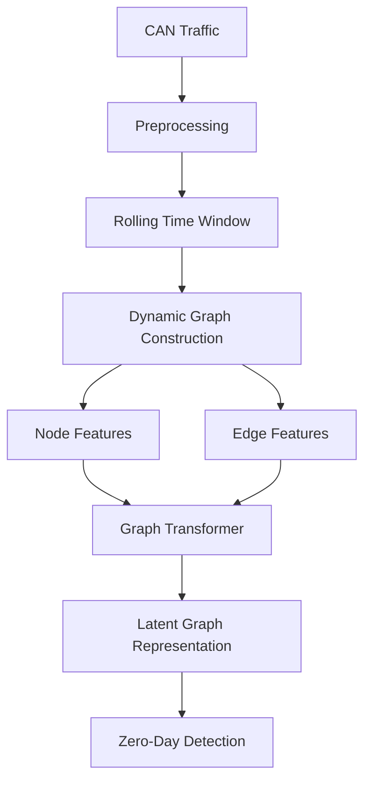

# Graph Transformer Architecture

## Overview

The Graph Transformer is the representation-learning component of the autonomous-vehicle CAN security system.

The primary purpose of this module is to transform temporal CAN communication into a structured graph representation and learn relationships between communicating components.

Traditional CAN intrusion-detection approaches often treat CAN frames as independent records or simple sequences. This can lose important information about **who communicates with whom, how frequently they communicate, and how those relationships evolve over time**.

This project instead represents CAN traffic as a sequence of dynamic graphs.

The Graph Transformer then learns relationships within those graphs and produces a latent graph representation that is passed to the zero-day anomaly-detection mechanism.

The complete flow is:

```text
CAN Traffic
    ↓
Preprocessing
    ↓
Temporal Windowing
    ↓
Dynamic Graph Construction
    ↓
Node & Edge Features
    ↓
Graph Transformer
    ↓
Latent Graph Representation
    ↓
Zero-Day Detection
```

---

## Purpose

The Graph Transformer is responsible for answering the following question:

> What does the current structure and behavior of the vehicle's CAN communication network look like?

It does **not** directly make the final security decision.

Its output is a learned representation that downstream components use for anomaly detection and explanation.

---

## Architecture



---

# 1. CAN Traffic

The module receives raw CAN communication generated by the vehicle network.

A CAN frame may contain information such as:

- CAN identifier
- Data payload
- Timestamp
- Data length
- Transmission frequency
- Inter-arrival time

The raw traffic is not immediately passed to the Graph Transformer.

It first undergoes preprocessing and temporal segmentation.

---

# 2. Preprocessing

The preprocessing stage converts raw CAN traffic into machine-learning-ready information.

Possible operations include:

- CAN frame parsing
- Timestamp normalization
- CAN ID encoding
- Payload representation
- Data-length extraction
- Inter-arrival-time calculation
- Message-frequency calculation
- Feature normalization
- Invalid-frame handling

The preprocessing stage should preserve both:

1. **Feature information**
2. **Temporal information**

because both are important to the downstream graph representation.

---

# 3. Rolling Temporal Windows

CAN communication is inherently time-dependent.

A single frame generally does not provide enough information to determine whether communication behavior is normal.

The system therefore groups traffic into rolling windows.

Conceptually:

```text
Window t-2
     ↓
Window t-1
     ↓
Window t
     ↓
Window t+1
```

Each window represents the communication state of the vehicle during a short period.

The choice of window size is an experimental parameter.

A window that is too small may fail to capture meaningful relationships.

A window that is too large may:

- increase computational cost
- blur short-lived anomalies
- reduce temporal resolution

---

# 4. Dynamic Graph Construction

Each temporal window is converted into a graph:

```text
G_t = (V_t, E_t)
```

where:

- `V_t` = nodes at time `t`
- `E_t` = edges at time `t`

The graph changes as communication behavior changes.

This creates a sequence:

```text
G_1 → G_2 → G_3 → ... → G_t
```

rather than a single static graph.

---

# 5. Node Representation

The exact node definition is an important experimental design decision.

Potential node representations include:

- ECUs
- CAN identifiers
- ECU-message entities
- Other communication-level entities

For the initial implementation, the graph representation should be selected based on what information the chosen dataset provides reliably.

Node features may include:

- Message frequency
- Message count
- Payload statistics
- Inter-arrival statistics
- CAN-ID characteristics
- Temporal behavior

---

# 6. Edge Representation

Edges represent communication relationships.

An edge can encode information such as:

- Communication frequency
- Direction
- Number of exchanged messages
- Temporal relationship
- Communication consistency

The graph therefore captures more than individual CAN frames.

It captures the structure of communication.

For example:

```text
ECU A ─────► ECU B
 │
 └─────────► ECU C
```

The Graph Transformer can learn that these relationships are meaningful parts of the vehicle's communication behavior.

---

# 7. Node and Edge Features

The graph contains both structural information and feature information.

### Node-level features

Potential examples:

```text
message_count
message_frequency
mean_interarrival_time
payload_statistics
identifier_features
temporal_statistics
```

### Edge-level features

Potential examples:

```text
communication_frequency
message_count
direction
temporal_relationship
communication_consistency
```

The exact feature set should remain configurable so that ablation experiments can determine which features actually contribute to detection.

---

# 8. Graph Transformer

The Graph Transformer receives the dynamic graph and its associated features.

Conceptually:

```text
Dynamic Graph
     ↓
Node Features + Edge Features
     ↓
Graph Transformer
     ↓
Latent Representation
```

The Transformer architecture allows the model to learn relationships between different graph elements using attention mechanisms.

This is particularly useful for CAN security because communication relationships are important.

The model can learn which components, relationships, and features are more relevant to the observed graph state.

---

# 9. Attention Mechanism

Attention allows the model to assign different importance to graph elements.

Conceptually:

```text
Graph Elements
     ↓
Attention
     ↓
Weighted Relationships
     ↓
Graph Representation
```

This attention information can later become one of the inputs to the explainability layer.

However, attention should not automatically be interpreted as a definitive causal explanation.

It is treated as **model evidence**.

---

# 10. Latent Graph Representation

The final output of this module is a latent representation of the observed graph.

This representation attempts to encode:

- Communication structure
- Node behavior
- Edge relationships
- Temporal behavior
- Feature interactions

The latent representation is passed to the zero-day detection mechanism.

```text
Graph Transformer
        ↓
Latent Graph Representation
        ↓
Graph Autoencoder
        ↓
Anomaly Analysis
```

---

# 11. Relationship With Zero-Day Detection

The Graph Transformer does not itself determine whether traffic is malicious.

Its responsibility is representation learning.

The next component evaluates whether the learned representation is consistent with expected behavior.

```text
Graph Transformer
        ↓
Latent Representation
        ↓
Graph Autoencoder
        ↓
Reconstruction Error
        ↓
Anomaly Score
```

This separation makes the architecture modular and allows the representation model to be evaluated independently.

---

# 12. Research Motivation

The Graph Transformer is included because CAN traffic is relational.

A frame-level model might learn:

```text
ID → Payload → Timestamp
```

The proposed graph-based model additionally attempts to learn:

```text
Component
   ↓
Communication Relationship
   ↓
Temporal Behavior
   ↓
Network Structure
```

This allows the project to investigate whether relational information improves detection of abnormal CAN behavior.

---

# 13. Experimental Questions

The Graph Transformer component can be evaluated through questions such as:

### RQ1

Does graph-based representation provide useful information compared with frame-level representations?

### RQ2

Does the Graph Transformer capture meaningful communication relationships?

### RQ3

Does temporal windowing improve anomaly detection?

### RQ4

Which node and edge features contribute most strongly to detection?

### RQ5

Does removing graph structure significantly reduce performance?

---

# 14. Ablation Studies

Possible ablations include:

```text
Full Graph Transformer
        │
        ├── Remove Edge Features
        ├── Remove Temporal Features
        ├── Remove Attention
        ├── Remove Graph Structure
        └── Reduce Node Features
```

These experiments can help determine whether the graph architecture actually contributes to the system rather than simply increasing model complexity.

---

# 15. Output

The primary output is:

```text
Latent Graph Representation
```

Secondary information that can be retained for explainability includes:

- Attention weights
- Node-level representations
- Edge-level representations
- Feature embeddings

These outputs are consumed by downstream components.

---

# 16. Design Principle

The central design principle is:

> Model CAN traffic as communication behavior rather than merely a sequence of independent messages.

The Graph Transformer therefore forms the representation-learning foundation of the overall security architecture.